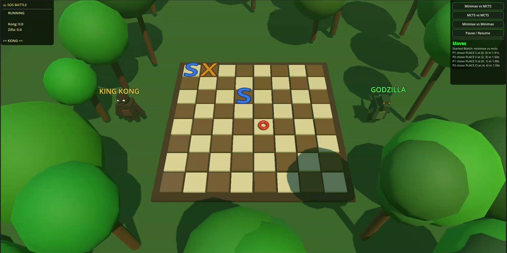

# Advanced SOS Board Game with AI Agents

> An autonomous 8×8 SOS board game where two AI agents compete head-to-head. Features **Minimax with Alpha-Beta pruning** and **Monte Carlo Tree Search** algorithms, with full 3D visualization in Godot 4.

**Submitted by:** Saleheen Uddin Sakin (2107103) & Sree Shuvo Kumar Joy (2107116)

---

## Quick Start

### Run with 3D Visualization

```bash
# Terminal 1: Start the API server
cd backend
python -m uvicorn main:app --host 0.0.0.0 --port 8000

# Terminal 2: Open Godot 4 → Import ui/godot_project/ → Press F5
```

### Run Headless (No UI)

```bash
python backend/simulation/match_runner.py
```

---

## Overview

Two AI agents battle on an **8×8 grid**, each trying to form **S-O-S** sequences. The project compares:

- **Minimax Agent** — Depth 3-4 exhaustive search with Alpha-Beta pruning
  - _Strength:_ Excellent endgame precision
  - _Weakness:_ Limited opening exploration

- **MCTS Agent** — Monte Carlo Tree Search with UCT selection + move pruning
  - _Strength:_ Superior opening & midgame strategy
  - _Weakness:_ Heuristic-limited endgame

**Key Finding:** MCTS excels in strategic phases; Minimax dominates tactical endgames.

---

## Game Rules

- **Grid:** 8×8 board with empty cells, S (1), O (2), or X (3) blockers
- **Scoring:** 1 point per S-O-S sequence (horizontal, vertical, diagonal)
- **Extra Turn:** Player scores SOS → plays again immediately
- **Skip Mechanic:** Choose an empty cell; opponent forced to play there next
- **X Blocker:** Occupies a cell, cannot form SOS, used defensively
- **Win Condition:** Highest SOS score when board is full

---

## System Architecture

```
├── backend/
│   ├── game_engine/         # Core logic
│   │   ├── state.py         # GameState, Move
│   │   ├── board.py         # Board utilities
│   │   ├── rules.py         # SOS detection, move validation
│   │   └── move_generator.py
│   │
│   ├── ai_agents/           # AI algorithms
│   │   ├── minimax_agent.py    # Alpha-Beta pruning
│   │   └── mcts_agent.py       # UCT + move pruning
│   │
│   ├── simulation/
│   │   ├── game_manager.py     # Single match
│   │   └── match_runner.py     # Batch experiments
│   │
│   └── main.py              # FastAPI server
│
└── ui/godot_project/        # Godot 4 visualization
    ├── board_renderer.gd    # 3D board + characters
    ├── agent_visualizer.gd  # HUD (scores, logs, buttons)
    ├── http_client.gd       # API polling
    └── jungle_environment.gd # Procedural trees
```

---

## Installation

### Prerequisites

- Python 3.10+
- Godot 4.x (optional, for visualization)
- `pip install fastapi uvicorn`

### Setup

```bash
git clone <repo>
cd SOS-Game
pip install fastapi uvicorn
```

---

## Usage

### Interactive Mode (with 3D Visualization)

```bash
# Start backend
cd backend && python -m uvicorn main:app --reload --port 8000

# In another terminal: Open Godot, import ui/godot_project/, press F5
```

### Headless Experiments

```bash
python backend/simulation/match_runner.py
```

Runs batch tests, prints win/loss/draw stats.

---

## AI Algorithms

### Minimax with Alpha-Beta Pruning

- **Search Depth:** 3-4 levels
- **Evaluation:** Handcrafted heuristic (score diff + potential + center control)
- **Time/Move:** ~2 seconds
- **Nodes Explored:** 15,000–35,000

### Monte Carlo Tree Search (MCTS)

- **Iterations:** Up to 2,000 per move (time-limited to 1.5s)
- **Move Pruning:** Top 12 moves selected by heuristic
- **Simulation:** Heuristic-guided rollouts (depth ≤10)
- **Time/Move:** ~1.5 seconds
- **Selection:** UCT formula with C=1.15

---

## Key Findings

| Aspect           | Minimax   | MCTS      |
| ---------------- | --------- | --------- |
| Opening Play     | Weak      | Strong ⭐ |
| Midgame          | Moderate  | Strong ⭐ |
| Endgame          | Strong ⭐ | Moderate  |
| SOS Detection    | Excellent | Good      |
| Skip/Force Usage | Poor      | Moderate  |
| Efficiency       | Good      | Moderate  |

---


## Visualization

## 📹 [Watch Gameplay Video](https://drive.google.com/file/d/14FC5GrKcn7LKJWtb-WoMCQAhcNA98Z8H/view?usp=sharing)




The Godot 4 frontend features:

- **Characters:** King Kong (Player 1) vs Godzilla (Player 2)
- **Animations:** Walk, stomp (S/O placement), thunder (X placement), head shake (skip)
- **Environment:** Jungle with procedural trees
- **HUD:** Live scores, move log, control buttons
- **Refresh Rate:** 0.5s polling of backend API

---

## Documentation

See [docs/](docs/) for detailed explanations:

- **[GAME_ENGINE.md](docs/GAME_ENGINE.md)** — State, board, rules, move generation
- **[AI_ALGORITHMS.md](docs/AI_ALGORITHMS.md)** — Minimax & MCTS theory + code
- **[SIMULATION.md](docs/SIMULATION.md)** — Match engine, experiments, stats
- **[GODOT_VISUALIZATION.md](docs/GODOT_VISUALIZATION.md)** — 3D UI & animations
- **[API_REFERENCE.md](docs/API_REFERENCE.md)** — FastAPI endpoints

---

## Future Work

- Progressive bias for UCT
- Opening book from pre-computed high-quality games
- Human vs AI play mode
- Enhanced X blocker valuation
